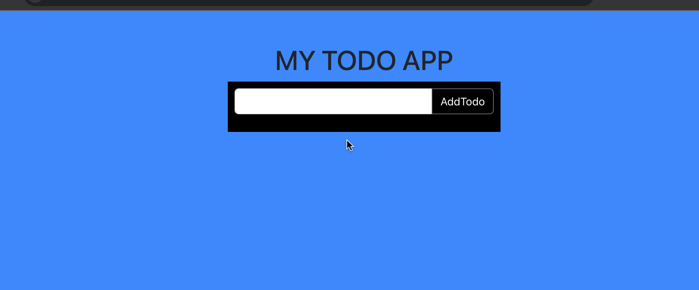
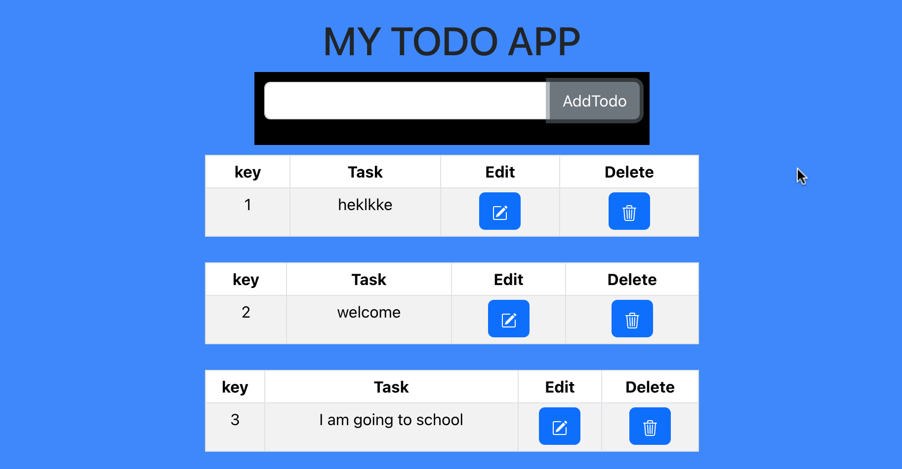
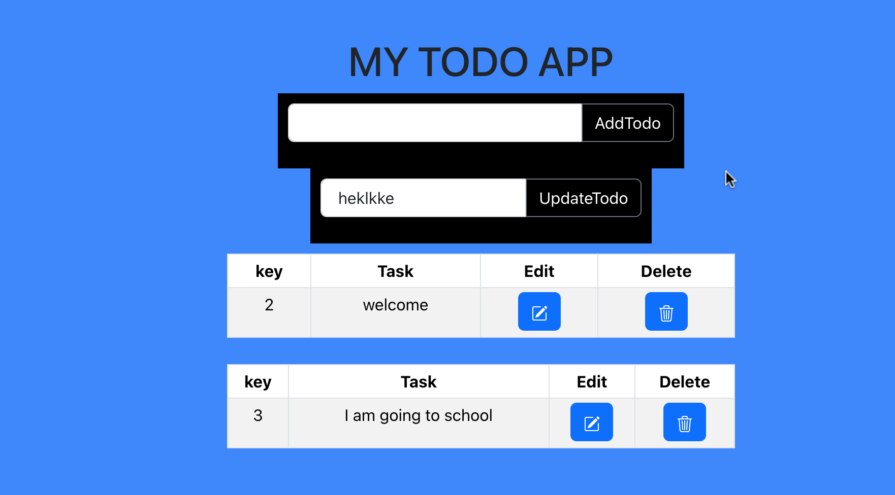
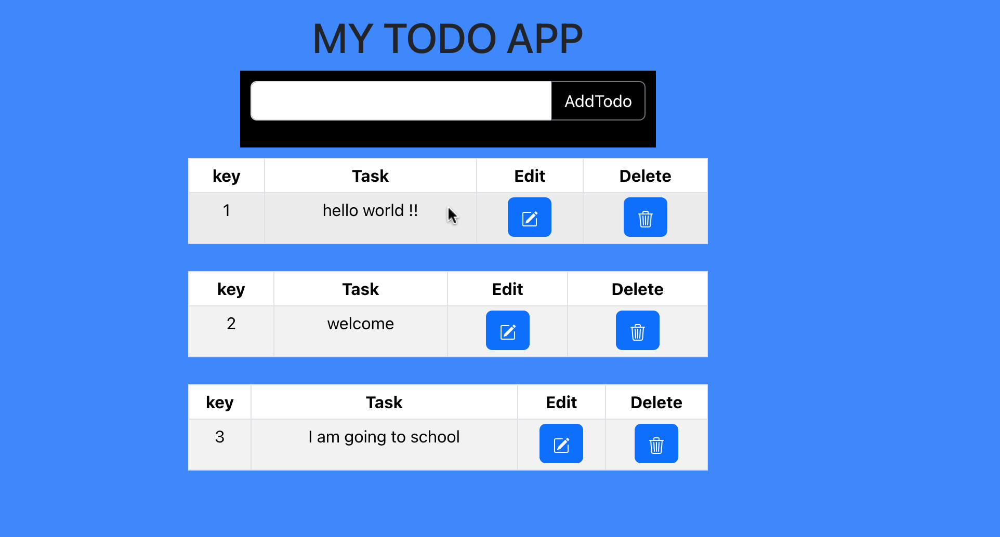

<h1>Todo List</h1>


<video width="320" height="240" autoplay>
  <source src="app" type="video">
  this is not playing
</video>







# Todo List 
This is a Todo List app built with reactJS,react-Bootstrap, Bootstrap Icons, and CSS. It contains the add Todo button, delete button, and edit button.


## Authors

- [Augustine-Cudjoe](https://www.github.com/Augustine-Cudjoe)


## Deployment

To deploy this project run

```bash
  cd todolist
  npm start
```


## 🚀 About Me
I'm a frontend developer and a mathematician.


## Installation

Install my-project with npm

```bash
  npx create-react-app todolist
  cd todolist
  npm install react-bootstrap bootstrap
  npm i bootstrap-icons

```
    
## License

[MIT](https://choosealicense.com/licenses/mit/)


## Tech Stack

**Client:** ReactJs, Bootstrap


